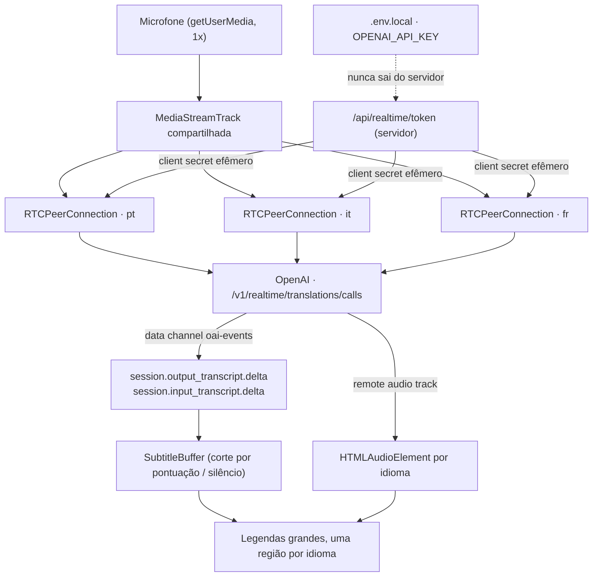

# Tradução ao vivo

Legenda e áudio de tradução simultânea para reuniões presenciais, em Next.js.
Um notebook com microfone, um ou mais idiomas de destino, e a tela vira um
painel de closed captions projetável.

Construído sobre a **Realtime Translation API** da OpenAI
(`gpt-realtime-translate`), speech-to-speech, sem o caminho antigo
microfone → Whisper → GPT → TTS.

Testado ponta a ponta contra a API real em 2026-09-12: legenda incremental,
áudio traduzido, dois idiomas simultâneos com uma única captura de microfone,
e adição/remoção de idioma sem interromper os demais. Detalhes e como
reproduzir em [`docs/roteiro-de-teste.md`](docs/roteiro-de-teste.md).

---

## Nota de implementação (registrada antes de escrever código)

Os oito pontos exigidos, todos verificados na documentação oficial em
**2026-09-12**. O estudo completo, com trechos citados e links, está em
[`docs/openai-realtime-translation.md`](docs/openai-realtime-translation.md).

1. **Endpoint.** Três, todos do namespace dedicado de tradução:
   - `POST https://api.openai.com/v1/realtime/translations/client_secrets` — no servidor, cria o segredo efêmero;
   - `POST https://api.openai.com/v1/realtime/translations/calls` — no browser, troca o SDP;
   - (`wss://api.openai.com/v1/realtime/translations` é o caminho WebSocket, usado só por pipelines de servidor — não é o caso aqui).

   Não é `/v1/realtime` nem `/v1/realtime/calls`: essas são de voice agent e o
   modelo as marca como *Not supported*.

2. **Modelo.** `gpt-realtime-translate`. Único snapshot, US$ 0,034 por minuto
   de áudio, 16k de context window, cutoff de 30/09/2024. O único endpoint que
   ele suporta é `v1/realtime/translations`. Para a transcrição da língua de
   origem, a sessão usa `gpt-realtime-whisper` em `audio.input.transcription`.

3. **Autenticação no browser.** A `OPENAI_API_KEY` vive só em `.env.local` e é
   lida exclusivamente dentro de
   [`app/api/realtime/token/route.ts`](app/api/realtime/token/route.ts)
   (`runtime = "nodejs"`, `dynamic = "force-dynamic"`). Esse Route Handler valida
   o idioma pedido contra a lista de 13, chama a OpenAI e devolve ao browser
   **apenas** `{ value, expiresAt }`. O `value` é o client secret de curta
   duração, usado como `Authorization: Bearer` só no POST do SDP. A chave
   permanente nunca entra em nenhum bundle do cliente e nunca vai do browser
   direto para a `api.openai.com`.

4. **Como o áudio chega à OpenAI.** Por WebRTC, como **media track** — não como
   mensagens de áudio. `getUserMedia()` roda **uma vez**; a `MediaStreamTrack`
   resultante é adicionada com `pc.addTrack()` a cada `RTCPeerConnection`
   (uma por idioma). Não há codificação PCM16 manual, nem
   `session.input_audio_buffer.append`: isso é o caminho WebSocket.

5. **Eventos de transcrição.** Chegam pelo data channel `oai-events`:
   - `session.output_transcript.delta` → `event.delta`, texto **traduzido**;
   - `session.input_transcript.delta` → `event.delta`, texto na **língua de origem** (só existe porque configuramos `audio.input.transcription`);
   - mais `session.created`, `session.updated`, `session.closed` e `error`.

   Os deltas são fragmentos *append-only*. A documentação é explícita: **não
   inserir espaços entre deltas**. A API **não emite evento de fim de frase**,
   então o corte em trechos é feito no cliente
   ([`lib/subtitleBuffer.ts`](lib/subtitleBuffer.ts)) por pontuação final,
   tamanho máximo ou silêncio de 2,2 s.

6. **Tradução para múltiplos idiomas.** O idioma de destino é fixado na criação
   da sessão (`session.audio.output.language`) e há **um idioma por sessão** —
   orientação literal do guia: *"Use one session per output language."* Três
   idiomas = três client secrets, três peer connections, três data channels,
   três audio tracks de retorno. Um único `getUserMedia`.

7. **Idiomas de saída suportados hoje — 13, lista exata.**

   | Código | Idioma | | Código | Idioma |
   |---|---|---|---|---|
   | `pt` | Português | | `ru` | Russo |
   | `en` | Inglês | | `zh` | Chinês |
   | `es` | Espanhol | | `ja` | Japonês |
   | `it` | Italiano | | `ko` | Coreano |
   | `fr` | Francês | | `hi` | Híndi |
   | `de` | Alemão | | `id` | Indonésio |
   | | | | `vi` | Vietnamita |

   A **entrada** é outra coisa: 70+ idiomas, **detectados automaticamente**.
   Não existe parâmetro para fixar o idioma falado, e isso foi verificado
   contra a API, não só lido: `session.audio.input.transcription.language` e
   `session.audio.input.language` retornam `400 unknown_parameter`, a mesma
   resposta que um campo inventado recebe. Por isso **não há seletor de idioma
   de entrada** — ele não teria o que controlar.

8. **Limitações relevantes.** Ver a seção [Limitações](#limitações) abaixo.

### O que divergiu do prompt original

- O prompt pedia `session.output_transcript.delta` — confirmado, é esse o nome.
- O prompt citava `/v1/realtime/translations/client_secrets` — confirmado.
- **Divergência encontrada dentro da própria documentação da OpenAI:** o guia
  desestrutura a resposta do client secret como `{ value }`, o texto do cookbook
  escreve `session.client_secret`. O código do demo oficial confirma que o campo
  é **`value`**. O Route Handler normaliza isso.
- O prompt sugeria permitir escolher o idioma de entrada como alternativa
  ("Caso contrário, permita selecionar explicitamente o idioma de entrada"). A
  API **rejeita** esse parâmetro — verificado com três requisições, incluindo um
  campo inventado como controle. Não há seletor.
- A interface mostra uma **onda de captura em blocos pretos**, no estado inicial
  e na barra da sessão, com rótulo "Captando" / "Sem som". Ela responde à
  pergunta que aparece na primeira vez que alguém usa: "o microfone está me
  ouvindo?". E quando a origem está sendo transcrita mas um idioma não produz
  tradução, o painel daquele idioma diz o porquê em vez de ficar em branco.

---

## Setup

```bash
npm install
npm run dev
```

Abra http://localhost:3000, clique em **Configurar** e cole a sua chave da
OpenAI. Ela fica no `localStorage` deste navegador, e o botão *Testar* confirma
de uma vez a chave, o saldo e o acesso ao modelo sem iniciar sessão nenhuma. O
modal também explica onde conseguir a chave e como a aplicação funciona.

Se preferir não guardar a chave no navegador — numa instância compartilhada,
por exemplo — use o servidor:

```bash
cp .env.example .env.local     # e preencha OPENAI_API_KEY
```

A chave salva pela interface tem precedência sobre a do `.env.local`. Em
qualquer um dos dois caminhos ela só é usada dentro do Route Handler, para criar
o segredo temporário da sessão, e nunca é persistida nem devolvida ao browser.

A chave precisa ter acesso a `gpt-realtime-translate`. O rate limit é medido em
**minutos de áudio por minuto**: Tier 1 = 50, o que significa até ~50 sessões
simultâneas.

> **Atenção à precedência de variáveis.** No Next.js, uma variável já exportada
> na shell tem prioridade sobre `.env.local`. Se o seu ambiente exporta
> `OPENAI_API_KEY` apontando para outro gateway (z.ai, OpenRouter, um proxy),
> o `.env.local` será ignorado e a chamada falha com 401. Verifique com
> `echo $OPENAI_BASE_URL` e rode `env -u OPENAI_API_KEY -u OPENAI_BASE_URL npm run dev`
> ou `unset OPENAI_API_KEY` antes de subir o servidor.

Outros comandos:

```bash
npm run lint      # ESLint
npx tsc --noEmit  # checagem de tipos
npm run build     # build de produção
```

Smoke test ponta a ponta contra a API real (precisa do servidor rodando):

```bash
APP_URL=http://localhost:3000 node scripts/smoke-test.mjs
```

`puppeteer-core` é a única devDependency além do que o Next traz, e existe só
para esse script. Detalhes em [`docs/roteiro-de-teste.md`](docs/roteiro-de-teste.md).

> O microfone só é liberado pelo navegador em `localhost` ou HTTPS.

---

## OpenAI

### Modelo

`gpt-realtime-translate` — speech-to-speech, treinado com áudio de intérpretes
profissionais. Recebe áudio, detecta o idioma de origem sozinho e devolve
**áudio traduzido + transcript traduzido + transcript da origem**.

Duas consequências de design que vêm do modelo:

- **Não há seleção de voz.** A fala traduzida imita tom e ritmo de quem falou
  ("dynamic voice adaptation"), e muda quando outra pessoa assume a palavra.
- **Não há prompt, glossário nem guia de pronúncia.** Nomes próprios e termos
  de domínio precisam ser testados caso a caso.

### Endpoint

Sessão de tradução não é sessão de voice agent. Não existe `response.create`,
nem turno, nem VAD, nem ferramenta: a tradução flui do próprio stream de áudio.
Por isso o endpoint é o dedicado, `/v1/realtime/translations`.

### Client secret

O browser nunca vê a `OPENAI_API_KEY`. O servidor cria um segredo efêmero com o
modelo e o idioma de saída já embutidos:

```jsonc
// POST /v1/realtime/translations/client_secrets
{
  "session": {
    "model": "gpt-realtime-translate",
    "audio": {
      "input": {
        "transcription": { "model": "gpt-realtime-whisper" },
        "noise_reduction": { "type": "far_field" }
      },
      "output": { "language": "pt" }
    }
  }
}
```

`far_field` é o modo para microfone de notebook ou de sala — o cenário desta
aplicação. Como toda a configuração vai no client secret, o cliente não precisa
mandar `session.update` depois de conectar.

### WebRTC

Para mídia no browser a OpenAI recomenda WebRTC, e é o que usamos: o áudio sobe
como media track e a tradução volta como remote track, sem reamostragem manual
nem reprodução de chunks PCM. O data channel `oai-events` carrega os transcripts.

### Por que uma sessão por idioma

Porque a documentação manda: *"Create one translation session for each target
language."* O idioma de saída é propriedade da sessão. O custo e o rate limit
acompanham: 10 minutos de reunião com 2 idiomas ≈ **20 minutos-idioma**.

O que **não** se multiplica é a captura: `getUserMedia()` roda uma vez e a mesma
`MediaStreamTrack` é adicionada a todas as peer connections — comportamento
padrão do WebRTC, cada `RTCPeerConnection` cria seu próprio `RTCRtpSender`.

---

## Chave do usuário

A aplicação funciona com a chave de quem a usa, colada no modal **Configurar** e
guardada no `localStorage`. O caminho continua sendo o mesmo:

```
localStorage → POST /api/realtime/token (mesma origem) → OpenAI → client secret efêmero → browser
```

O que muda é o risco, e vale dizer sem rodeio: **uma chave no `localStorage` é
legível por qualquer script que rode na página**. Isso é adequado para uso local
ou numa instância que só você acessa. Não publique esta aplicação com a sua
chave num ambiente compartilhado — nesse caso use `OPENAI_API_KEY` no servidor,
que é o caminho em que a chave nunca chega ao cliente. O modal diz isso ao
usuário, não só ao leitor deste README.

`GET /api/realtime/token` responde apenas `{ serverKey: boolean }`, para a
interface saber se precisa pedir a chave. Não expõe nem toca o valor.

## Interface

Tailwind CSS v4 e **shadcn/ui** (primitivos Radix) para Button, Checkbox, Label,
Select, Slider, Badge, Alert e Separator. O tema do shadcn foi ajustado ao
briefing em vez do contrário: `--radius` em 3px, cinzas neutros, preto no
primário, e `--font-sans` apontando para a Inter do `next/font`, de modo que a
biblioteca inteira herda a fonte certa.

O CSS próprio ficou reduzido a três coisas que utilitário não expressa bem: a
pilha de fontes com fallback para CJK e devanágari (Inter não cobre esses
alfabetos), a escala tipográfica das legendas por densidade, e o grid.

A onda de captura é um `<canvas>` que desenha blocos pretos de 3px simétricos em
torno do eixo, com histórico rolando. Escreve direto no canvas; o estado de
React só muda quando a resposta muda — "Captando" ou "Sem som" —, não a cada
quadro.

## Arquitetura



### Arquivos

```
app/
  layout.tsx                     Inter via next/font/google
  page.tsx                       orquestração: idle ↔ ao vivo
  globals.css                    todo o estilo (branco, Inter, sem decoração)
  api/realtime/token/route.ts    ÚNICO lugar que toca a OPENAI_API_KEY

components/
  LanguageSelector.tsx           os 13 idiomas de saída (tela inicial)
  LanguageMenu.tsx               dropdown de idiomas + original (tela ao vivo)
  ReadingMenu.tsx                tamanho, 5 fontes e organização das legendas
  MicrophoneSelector.tsx         enumerateDevices + onda de captura
  AudioWaveform.tsx              onda em blocos pretos + diagnóstico da captura
  SessionControls.tsx            barra discreta da sessão ao vivo
  SettingsDialog.tsx             modal: chave da API e como funciona
  TranscriptHistory.tsx          modal: histórico, copiar, salvar, apagar
  ConfirmDialog.tsx              confirmação de toda ação destrutiva
  TranslationDisplay.tsx         grid responsivo + transcrição original
  TranslationPanel.tsx           uma região de legenda + controles de áudio
  ui/                            componentes do shadcn (gerados pela CLI)

hooks/
  useMicrophone.ts               dono único da fonte de áudio
  useRealtimeTranslation.ts      Map<idioma, TranslationSession>, uso, timers

lib/
  utils.ts                       `cn` do shadcn
  apiKey.ts                      chave do usuário no localStorage
  audioSource.ts                 AudioSource: microphone | display (tab audio)
  fonts.ts                       as 5 fontes de legenda
  languages.ts                   lista oficial + validação
  subtitleBuffer.ts              deltas → trecho atual / anterior
  transcriptLog.ts               histórico e preferências no localStorage
  usage.ts                       minutos-idioma, relógio e pausa
  openai/realtimeTranslation.ts  TranslationSession (WebRTC, eventos, reconexão)

types/
  realtime.ts                    tipos dos eventos da API

docs/
  openai-realtime-translation.md estudo completo da API com fontes
```

### `TranslationSession`

Cada instância é dona de um idioma de saída: uma `RTCPeerConnection`, um data
channel, um `HTMLAudioElement`, seu transcript e seu próprio ciclo de reconexão.
`cleanup()` fecha tudo. A track de áudio **não** é parada por ela — é
compartilhada, quem a encerra é o `useMicrophone`.

Reconexão: `failed` reconecta na hora, `disconnected` espera 4 s (o ICE
costuma se recuperar sozinho), backoff de 1/2/4/8/15 s e no máximo 5 tentativas
antes de virar erro visível. Um contador de geração invalida callbacks de
tentativas antigas, então nunca há sessão duplicada. Só a sessão afetada
reconecta — as outras seguem traduzindo.

### `AudioSource`

A captura está isolada em `lib/audioSource.ts` com dois modos: `microphone`
(`getUserMedia`) e `display` (`getDisplayMedia`, com
`suppressLocalAudioPlayback` quando o navegador suporta). Hoje a interface só
expõe o microfone; trocar para áudio de aba — o caminho para reuniões no Teams —
é mudar o parâmetro, não a arquitetura.

---

## Idiomas suportados

### Saída — 13 (encontrados na documentação oficial em 2026-09-12)

`pt` Português · `en` Inglês · `es` Espanhol · `it` Italiano · `fr` Francês ·
`de` Alemão · `ru` Russo · `zh` Chinês · `ja` Japonês · `ko` Coreano ·
`hi` Híndi · `id` Indonésio · `vi` Vietnamita

A lista é validada duas vezes: no cliente (só esses aparecem na tela) e no
servidor (o Route Handler rejeita qualquer outro código antes de chamar a
OpenAI, para não virar proxy aberto).

### Entrada — 70+, detectados automaticamente

Árabe, Africâner, Azerbaijano, Bielorrusso, Bengali, Bósnio, Búlgaro, Catalão,
Chinês, Croata, Tcheco, Dinamarquês, Holandês, Dzongkha, Inglês, Esperanto,
Estoniano, Basco, Persa, Finlandês, Filipino, Francês, Galego, Alemão, Grego,
Guzerate, Crioulo haitiano, Havaiano, Hebraico, Híndi, Húngaro, Armênio,
Indonésio, Italiano, Japonês, Javanês, Georgiano, Cazaque, Coreano, Curdo,
Latim, Letão, Lituano, Macedônio, Malaio, Malaiala, Maori, Mongol, Birmanês,
Nepali, Norueguês, Nynorsk, Polonês, Português, Punjabi, Romeno, Russo, Sérvio,
Shona, Eslovaco, Esloveno, Albanês, Espanhol, Suaíli, Sueco, Tagalo, Telugo,
Tailandês, Turco, Ucraniano, Uzbeque, Vietnamita, Galês, Iorubá.

---

## Limitações

Todas verificadas na documentação — nenhuma é suposição.

1. **Falar no idioma de destino pode gerar silêncio.** O modelo evita traduzir
   fala que já está no idioma de saída. Com saída em português e alguém falando
   português, aquele trecho pode simplesmente não produzir nada. Por isso a
   aplicação mantém a opção de transcrição original e nunca muta o ambiente.
2. **Code-switching é assimétrico.** "Portunhol → alemão" funciona; "portunhol →
   português" fica irregular, porque as partes já em português ficam mudas.
3. **Não dá para fixar o idioma falado.** Verificado contra a API:
   `session.audio.input.transcription.language` e `session.audio.input.language`
   retornam `400 unknown_parameter`. A detecção automática é a única opção.
4. **Sem prompt, glossário ou guia de pronúncia.** Termos de domínio — "Holter",
   nomes de médicos, siglas — podem ser substituídos incorretamente. Vale montar
   um conjunto de teste antes de usar em reunião que importa.
5. **Sem seleção de voz.** A voz de saída acompanha o falante.
6. **Saída tem 13 idiomas, entrada tem 70+.** Não são o mesmo conjunto.
7. **Sem speaker labels, sem timestamps por palavra, sem confidence.**
   Diarização existe só em `/v1/audio/transcriptions` com
   `gpt-4o-transcribe-diarize`, que este modelo não suporta.
8. **Sem evento de fim de frase.** O corte de trechos é heurística do cliente.
   Um trecho pode fechar cedo demais numa abreviação longa, ou tarde demais se a
   pessoa falar sem pontuação por mais de 260 caracteres.
9. **Custo e rate limit multiplicam por idioma.** US$ 0,034/min × sessões ativas.
   A aplicação mede minutos-idioma internamente (visível no painel de controles)
   mas **não** exibe preço — a tabela da OpenAI muda.
10. **`session.close` só é descrito para WebSocket.** No WebRTC encerramos com
   `dataChannel.close()` + `pc.close()`, como faz o demo oficial; áudio residual
   em drenagem é descartado.
11. **Não há resume de sessão.** Reconectar significa criar um client secret
    novo e uma peer connection nova. O transcript já exibido é preservado na
    tela, mas o que foi falado durante a queda se perde.
12. **O modelo às vezes emite deltas sem o espaço de separação.** Visto uma vez
    em teste: `"esse áudio"` + `"do próprio app"` chegou concatenado como
    `"áudiodo"`. A documentação proíbe inserir espaços entre deltas — a regra
    existe porque isso quebraria japonês, chinês e coreano — então a aplicação
    concatena cru, como mandado, e o artefato é do modelo.
13. **Autoplay.** O áudio traduzido começa depois do clique em "Iniciar
    tradução", o que satisfaz a política de autoplay dos navegadores. Se o
    usuário ativar o som de um idioma sem interação recente, o navegador pode
    bloquear — o erro é logado no console.

---

## Privacidade

Nada é gravado **no servidor**. Não há banco, não há upload de áudio, não há log
de transcript. O que existe é armazenamento local, no navegador de quem usa:
histórico de transcrições, preferências de leitura e, se o usuário quiser, a
chave da API — tudo apagável pela própria interface, com confirmação.

> Mudança em relação ao desenho original, que dizia "tudo deve existir apenas
> durante a sessão no browser": o transcript agora **sobrevive** ao fim da
> sessão, no `localStorage`. Foi pedido explicitamente. A fronteira que não
> mudou é a do servidor. O Route Handler só repassa o pedido de client secret
e não vê nem o áudio nem o texto. Tudo vive na memória da aba até "Parar", que
fecha todas as `RTCPeerConnection`, para as tracks locais, limpa os elementos de
áudio e cancela os timers de reconexão. O header `OpenAI-Safety-Identifier`
carrega um identificador anônimo por processo, nunca um dado pessoal.

---

## Uso

1. **Configurar** e cole a chave da OpenAI (só na primeira vez).
2. Confira a onda ao lado do seletor de microfone. Ela diz "Captando" quando
   está ouvindo você, e explica o motivo quando não está — ver abaixo.
3. Marque um ou mais idiomas de destino.
4. "Iniciar tradução". A legenda começa a crescer enquanto a pessoa ainda fala.
5. Durante a sessão: **Idiomas** liga e desliga destinos sem parar os demais;
   **Leitura** ajusta tamanho, fonte e organização; **Pausar** interrompe a
   captura e a cobrança sem perder o texto; **Limpar** zera a transcrição;
   **Histórico** abre o que já foi gravado.
6. "Parar" encerra tudo e guarda a sessão no histórico.

### Quando a onda não se mexe

Três causas produzem a mesma tela vazia e têm soluções diferentes. O rótulo ao
lado da onda diz qual é:

| Rótulo | O que é | O que fazer |
|---|---|---|
| **Bloqueado pelo sistema** | `track.muted === true`: o SO não entrega amostras | macOS: Ajustes → Privacidade e Segurança → Microfone → ligar o navegador, e recarregar. A permissão da *página* pode estar concedida mesmo assim. |
| **Toque na página** | `AudioContext` suspenso: o navegador não mede áudio antes de um gesto | Clicar em qualquer lugar. |
| **Sem som** | Microfone aberto, sem sinal | Conferir o dispositivo selecionado e se ele não está mudo no sistema. |

O console também loga `[mic] track` com `label`, `readyState`, `muted` e
`getSettings()`.

Por padrão só o **primeiro** idioma começa audível — três traduções falando
juntas é ruído. As legendas dos outros continuam funcionando normalmente mesmo
mutadas.

**Pausar** é pausa de verdade: o áudio para de subir, as sessões são fechadas e
a cobrança por minuto para junto. O texto fica onde está e a retomada continua
de onde parou. O relógio congela — ele mede tempo traduzindo, não tempo de aba
aberta.

O **histórico** guarda cada sessão no `localStorage` com data, duração, idiomas
e número de trechos, e salva sozinho a cada 15 s (e quando a aba some), para uma
reunião longa não se perder num fechamento acidental. Dá para copiar, salvar em
`.txt` ou apagar — uma a uma ou tudo, sempre com confirmação.

As **5 fontes** são Inter, Atkinson Hyperlegible (desenhada para legibilidade a
distância), Source Serif, IBM Plex Sans e JetBrains Mono. Só a Inter carrega
cirílico e vietnamita; nas outras, russo e vietnamita caem no fallback do
sistema.

O console do navegador registra, por sessão: idioma, estado da conexão, tempo
até conectar, tempo até o primeiro delta de transcript, tempo até o primeiro
áudio, reconexões e erros da API. Nenhum segredo é logado.
